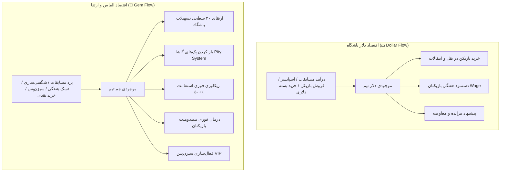

# سند طراحی معماری اقتصاد دوارزی (Dual-Currency Economy Design)
**پروژه:** لیگ شبیه‌ساز مجازی مستر لیگ (Virtual Master League - VML)  
**تاریخ تصویب و نهایی‌سازی:** ۲۶ مرداد ۱۴۰۵ (17 August 2026)  
**وضعیت:** تصویب شده و آماده پیاده‌سازی  

---

## ۱. مقدمه و فلسفه طراحی
در بازی‌های مدیریتی ورزشی سطح بالا، تفکیک اقتصاد بازی به دو ارز مجزا باعث ایجاد تعادل بین **پیشرفت ارگانیک و مهارت‌محور مربی** از یک سو و **انگیزه‌های شخصی‌سازی، توسعه سریع و درآمدزایی (Monetization)** از سوی دیگر می‌شود.

در Virtual Master League، دو ارز تعریف شده است:
1. **دلار باشگاه (💵 Club Budget / Virtual Dollars)**: ارز اصلی عملیات فوتبالی، نقل و انتقالات و مدیریت باشگاه.
2. **الماس / جم (💎 Gems / Premium Currency)**: ارز توسعه، شتاب‌دهنده، ارتقای زیرساخت‌ها، گاشا و محتوای VIP.

---

## ۲. مشخصات و کاربرد دلار باشگاه (💵 Club Budget)

### ۲.۱. ماهیت
ارز مالی مبتنی بر گردش اقتصادی فوتبال واقعی. این ارز مستقیماً قدرت خرید مربی در بازار ترانسفر و توانایی پرداخت دستمزد ستارگان تیم را تعیین می‌کند.

### ۲.۲. کاربردها و مصارف (Sinks)
* **بازار نقل و انتقالات (Transfers):**
  * خرید مستقیم بازیکنان لیست‌شده مربیان دیگر (`Fixed Price`).
  * شرکت در مزایده‌های ترانسفر مارکت (`Auctions`).
  * پرداخت بخش نقدی در پیشنهادهای معاوضه بازیکن (`Swap Deals`).
  * جذب بازیکنان آزاد (`Free Agents`).
* **دستمزد و هزینه‌های جاری باشگاه:**
  * پرداخت دوره‌ای/هفتگی دستمزد بازیکنان بر اساس قرارداد (`Player.wage`).
  * رعایت سقف دستمزد کل باشگاه (`Team.wage_cap`).
* **فسخ و تعدیل قرارداد:**
  * پرداخت خسارت آزادسازی زودهنگام یا فسخ توافقی با بازیکنان مازاد.

### ۲.۳. منابع کسب درآمد (Sources)
* **پاداش مسابقات (Match Rewards):**
  * پاداش پایه برد، مساوی و باخت.
  * پاداش به ازای هر گل زده (`REWARD_PER_GOAL`).
  * پاداش ثبت کلین‌شیت (`REWARD_CLEAN_SHEET`).
* **درآمدهای تجاری روز مسابقه و اسپانسر:**
  * بلیت‌فروشی استادیوم (ضریب اثر وابسته به سطح استادیوم).
  * قرارداد هفتگی اسپانسرها (وابسته به سطح رسانه‌ای و محبوبیت تیم).
* **فروش بازیکنان:** درآمد حاصل از فروش یا انتقال قرضی بازیکنان تیم.
* **فروشگاه (Store):** امکان خرید بسته‌های تزریق سرمایه دلاری با پرداخت ریالی/کارت‌به‌کارت.

---

## ۳. مشخصات و کاربرد الماس / جم (💎 Gems)

### ۳.۱. ماهیت
ارز ویژه و استراتژیک برای توسعه تیم، شانس، ارتقای زیرساخت‌ها و خدمات شتاب‌دهنده که هم از طریق شایستگی در بازی (F2P) و هم از طریق خرید مستقیم به دست می‌آید.

### ۳.۲. کاربردها و مصارف (Sinks)
* **ارتقای تسهیلات باشگاه (Club Facilities):**
  * ارتقای ۷ بخش اصلی تسهیلات (کمپ تمرینی، بدنسازی، پزشکی، استخر، استادیوم، آکادمی، استعدادیابی) تا سطح ۲۰ با هزینه تصاعدی جم.
* **پک‌های گاشا (Gacha Packs):**
  * باز کردن پک‌های شانس بازیکنان (Rare، Epic، Legendary) به همراه مکانیک شمارنده تضمینی (Pity Counter).
* **ریکاوری سریع و پزشکی بازیکنان:**
  * ⚡ **شارژ فوری انرژی (+۵۰٪ استقامت):** رفع قفل خستگی و آماده‌سازی بازیکن برای مسابقه بعدی (مثلاً ۱۰ جم).
  * 🩹 **درمان فوری مصدومیت:** از بین بردن زمان نقاهت مصدومیت بازیکن (مثلاً ۲۵ جم).
* **سیزن‌پس VIP:** فعال‌سازی مسیر جوایز پرمیوم و بازیکنان لجندری اختصاصی پاس فصلی.

### ۳.۳. منابع ورودی و کسب جم (Inflow Sources)
* **برد در مسابقات رسمی:** پاداش جم ثابت به ازای هر پیروزی در مسابقات لیگ یا کاپ.
* **پاداش شگفتی‌سازی (Underdog / Giant Killer Bonus):** دریافت جم مضاعف در صورت غلبه بر تیمی که میانگین اورال تیمی یا رتبه بالاتری دارد.
* **تکمیل تسک‌های هفتگی (Weekly Tasks):** پاداش جم برای تکمیل ماموریت‌هایی مثل گلزنی، کلین‌شیت و ثبت به موقع ترکیب.
* **سیزن‌پس رایگان (Free Season Pass):** پاداش‌های مرحله‌ای جم در لول‌های مختلف سیزن‌پس برای همه مربیان.
* **خرید مستقیم از فروشگاه:** بسته‌های جم با درگاه پرداخت آنلاین زرین‌پال یا پرداخت کارت‌به‌کارت.

---

## ۴. ماتریس مقایسه‌ای دو ارز

| بخش بازی | 💵 دلار باشگاه (Budget) | 💎 الماس / جم (Gems) |
| :--- | :---: | :---: |
| **خرید و فروش بازیکن بین مربیان** | ✅ ارز اصلی | ❌ غیرفعال |
| **دستمزد هفتگی بازیکنان** | ✅ ارز اصلی | ❌ غیرفعال |
| **ارتقای سطح تسهیلات باشگاه (Facilities)** | ❌ غیرفعال | ✅ ارز انحصاری (تصاعدی) |
| **باز کردن پک‌های شانس گاشا (Gacha)** | ❌ غیرفعال | ✅ ارز اصلی |
| **ریکاوری فوری استقامت خستگی** | ❌ غیرفعال | ✅ فعال (دکمه سریع) |
| **درمان فوری مصدومیت بازیکن** | ❌ غیرفعال | ✅ فعال (دکمه سریع) |
| **فعال‌سازی سیزن‌پس VIP** | ❌ غیرفعال | ✅ فعال |
| **پاداش برد مسابقات** | ✅ دلار بالا | ✅ پاداش جم |
| **پاداش شگفتی‌سازی (Underdog)** | ❌ پاداش عادی | ✅ پاداش ویژه جم |
| **خرید مستقیم در فروشگاه (ریالی)** | ✅ بسته‌های بودجه | ✅ بسته‌های جم |

---

## ۵. مشخصات فنی و تغییرات رابط کاربری (UI/UX Specifications)

### ۵.۱. هدر اصلی (Top Header)
* جایگزینی نشانگر تک‌ارزی با **دو کپسول مستقل و شیک**:
  * **کپسول دلار:** با آیکون سکه/دلار طلایی یا سبز نئونی و فرمت عددی فارسی (مثال: `$۱,۲۵۰,۰۰۰`).
  * **کپسول جم:** با آیکون الماس درخشان فیروزه‌ای/بنفش و انیمیشن براق (مثال: `💎 ۴۵۰`).
  * کلیک روی هر کپسول به صورت هوشمند کاربر را به تب مربوطه در فروشگاه هدایت می‌کند.

### ۵.۲. تب فروشگاه (Store Tab)
* ساختار ساب‌تب‌های شفاف:
  1. **الماس و جم 💎:** بسته‌های مختلف جم (بسته اقتصادی، بسته مربی، خزانه جم).
  2. **بودجه باشگاه 💵:** بسته‌های تزریق سرمایه دلاری برای تقویت بودجه ترانسفر.
  3. **پک‌های گاشا 🎁:** نمایش پک‌های فعال با قیمت جم و شانس درصدی هر ردیف.
  4. **پاس فصلی 👑:** وضعیت پیشرفت لول‌ها و دکمه ارتقا به VIP.
  5. **پیگیری پرداخت‌ها:** وضعیت درخواست‌های کارت‌به‌کارت و سوابق تراکنش.

### ۵.۳. تسهیلات باشگاه (Club Facilities Tab)
* کارت‌های تسهیلات (`FacilityCard`):
  * نمایش قیمت هر لول به جم 💎.
  * غیرفعال شدن خودکار دکمه ارتقا و نمایش پیام هشدار کمبود جم در صورت کافی نبودن موجودی.

### ۵.۴. کارت و پروفایل بازیکن (Player Lineup & Profile)
* افزودن اکشن‌های سریع:
  * دکمه **«⚡ ریکاوری انرژی (+۵۰٪)»** با هزینه ۱۰ جم.
  * دکمه **«🩹 درمان فوری مصدومیت»** با هزینه ۲۵ جم.

---

## ۶. اقدامات اجرایی مورد نیاز (Implementation Roadmap)

1. **بک‌اند (Backend):**
   * بروزرسانی متدهای سرویس ارتقای تسهیلات در `teams/services.py` یا `teams/views.py` جهت کسر جم (Gems) به جای دلار.
   * ایجاد اندپوینت‌های اختصاصی ریکاوری فوری استقامت و درمان مصدومیت با کسر اتمیک جم (`economy/services.py`).
   * پیاده‌سازی منطق محاسبه پاداش جم برای بردهای معمولی و پاداش شگفتی‌سازی (Underdog Bonus) در `economy/formulas.py` و ثبت رویدادهای مسابقه.
   * پشتیبانی از فروش بسته‌های جم و دلار در `StorePackage` با مشخص کردن نوع ارز اعطایی (`currency_reward_type`).

2. **فرانت‌اند (Frontend):**
   * بازطراحی کامپوننت `Header.jsx` برای نمایش همزمان موجودی دلار و جم به صورت Live.
   * بروزرسانی `FacilityCard.jsx` و `ClubTab.jsx` جهت نمایش هزینه جم.
   * افزودن مودال یا دکمه‌های ریکاوری سریع بازیکن در `PlayerCardModal` و صفحه ترکیب `TeamTab`.
   * بهینه‌سازی فروشگاه `StoreTab.jsx` جهت تفکیک خرید بسته‌های جم و دلار.
