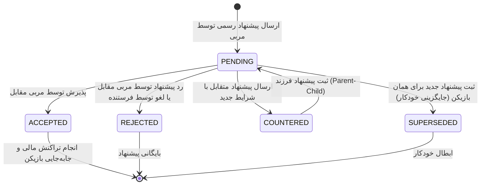

# 📋 راهنمای جامع و مستندات فرآیند نقل و انتقالات (Transfer System Guide)
### لیگ مجازی مستر لیگ (Virtual Master League - VML)

این سند فرآیند کامل، ساختار فنی، انواع قراردادها و منطق حاکم بر سیستم نقل و انتقالات و مذاکرات بازیکنان را تشریح می‌کند.

---

## 📑 فهرست مطالب
1. [انواع نقل و انتقالات و معاملات](#۱-انواع-نقل-و-انتقالات-و-معاملات)
2. [چرخه حیات یک پیشنهاد (Offer Lifecycle)](#۲-چرخه-حیات-یک-پیشنهاد-offer-lifecycle)
3. [فرآیند مذاکره و پیشنهاد متقابل (Counter-Offer)](#۳-فرآیند-مذاکره-و-پیشنهاد-متقابل-counter-offer)
4. [منطق مالی و تراکنش‌های بودجه](#۴-منطق-مالی-و-تراکنشهای-بودجه)
5. [سیستم انتقال قرضی و بازگشت خودکار](#۵-سیستم-انتقال-قرضی-و-بازگشت-خودکار)
6. [فسخ قرارداد و بازار بازیکنان آزاد](#۶-فسخ-قرارداد-و-بازار-بازیکنان-آزاد)
7. [قوانین سقف دستمزد و کنترل مازاد تیم (Wage Cap & Overflow)](#۷-قوانین-سقف-دستمزد-و-کنترل-مازاد-تیم)
8. [ایمنی، تأیید دو مرحله‌ای و گزارش‌گیری](#۸-ایمنی-تأیید-دو-مرحلهای-و-گزارشگیری)

---

## ۱. انواع نقل و انتقالات و معاملات

در پلتفرم VML، مربیان می‌توانند از سه روش اصلی برای جذب یا واگذاری بازیکنان استفاده کنند:

| نوع انتقال (`offer_type`) | شرح و مکانیزم | الزامات و ویژگی‌ها |
| :--- | :--- | :--- |
| **خرید قطعی (`DIRECT_TRANSFER`)** | انتقال کامل و دائمی مالکیت بازیکن در ازای مبلغ نقدی (دلار). | • کسر آنی مبلغ از خریدار و واریز به فروشنده • انتقال دائمی کارت بازیکن به ترکیب خریدار |
| **معاوضه بازیکن (`SWAP`)** | تبادل ۱ تا ۳ بازیکن بین دو تیم همراه با پرداخت یا دریافت مابه‌التفاوت نقدی اختیاری. | • جابه‌جایی متقابل بازیکنان انتخاب‌شده • تسویه مابه‌التفاوت نقدی بین دو باشگاه |
| **انتقال قرضی (`LOAN`)** | انتقال موقت بازیکن برای تعداد مشخصی بازی (مثلاً ۱۰ تا ۱۵ بازی) در ازای هزینه قرض. | • تعیین تعداد بازی‌های مجاز (`loan_duration_matches`) • حفظ مالکیت اصلی در باشگاه مبدأ |

---

## ۲. چرخه حیات یک پیشنهاد (Offer Lifecycle)

هر پیشنهاد نقل و انتقالاتی از زمان ثبت تا نهایی‌شدن، یکی از وضعیت‌های زیر را طی می‌کند:

### توضیحات وضعیت‌ها:
* **`PENDING` (در انتظار بررسی):** پیشنهاد فعال است و در صندوق ورودی مربی مقصد و صندوق خروجی فرستنده قرار دارد.
* **`ACCEPTED` (پذیرفته‌شده / تایید نهایی):** مربی گیرنده پیشنهاد را تأیید کرده و ترانسفر بلافاصله با موفقیت نهایی می‌شود.
* **`REJECTED` (رد / لغو شده):** پیشنهاد توسط گیرنده رد شده یا توسط فرستنده پیش از تصمیم‌گیری لغو شده است.
* **`COUNTERED` (پیشنهاد متقابل داده شده):** مربی گیرنده مبلغ یا شرایط را تغییر داده و پیشنهاد جدیدی ارسال کرده است.
* **`SUPERSEDED` (منقضی / جایگزین شده):** اگر پیشنهاد جدیدی برای همان بازیکن ارسال شود، پیشنهادات قبلی به صورت خودکار باطل می‌شوند تا از تداخل جلوگیری شود.

---

## ۳. فرآیند مذاکره و پیشنهاد متقابل (Role-Locked Counter-Offer)

اگر مربی فروشنده مبلغ پیشنهادی را کم بداند یا خواستار معاوضه بازیکن دیگری از تیم خریدار باشد:
1. **قفل نقش فروشنده (Role-Locking):** در پیشنهاد متقابل، مربی فروشنده (مالک بازیکن هدف) فقط می‌تواند:
   - مبلغ درخواستی نقدی را تغییر دهد (مثلاً درخواست مبلغ بیشتر برای فروش).
   - تا ۳ بازیکن را **از ترکیب تیم خریدار** برای معاوضه انتخاب کند.
   - مربی فروشنده نمی‌تواند از تیم خودش پول پیشنهاد دهد یا بازیکن دیگری از تیم خود اضافه کند (جلوگیری از انحراف و معکوس شدن معامله).
2. **پیوند والد و فرزند (`parent_offer`):** سیستم پیشنهاد اولیه را به وضعیت `COUNTERED` برده و پیشنهاد جدید را با اشاره به شناسه پیشنهاد قبلی به عنوان پیشنهاد فعال ثبت می‌کند.
3. **انتقال به صندوق نوبت پاسخ:** پیشنهاد متقابل جدید با برچسب «نوبت پاسخ شما ⏳» به صندوق خریدار فرستاده می‌شود تا او تصمیم‌گیری (قبول، رد یا چانه‌زنی مجدد) کند.

---

## ۴. منطق مالی و تراکنش‌های بودجه

سیستم تسویه حساب به گونه‌ای پیاده‌سازی شده که **فارغ از اینکه چه کسی آخرین پیشنهاد متقابل را ثبت کرده است**، نقش‌های خریدار و فروشنده را از روی **مالکیت فعلی بازیکن** به صورت هوشمند تشخیص می‌دهد:

$$\text{تیم خریدار (Buyer)} = \text{تیمی که بازیکن در ترکیب آن نیست و به ترکیبش اضافه می‌شود}$$
$$\text{تیم فروشنده (Seller)} = \text{تیمی که مالک فعلی بازیکن است}$$

### مراحل تراکنش در زمان تأیید (`accept_transfer_offer`):
1. **اعتبارسنجی بودجه خریدار:** بررسی اینکه آیا بودجه نقد خریدار $\ge$ مبلغ معامله هست یا خیر.
2. **کسر اتمیک از خریدار:** مبلغ به صورت اتمیک (`process_atomic_wallet_update`) از کیف پول دلاری خریدار با لاگ `TRANSFER_BUY` کسر می‌شود.
3. **واریز اتمیک به فروشنده:** همان مبلغ به کیف پول دلاری فروشنده با لاگ `TRANSFER_SELL` واریز می‌شود.
4. **انتقال کارت بازیکن:** کارت بازیکن به تیم خریدار منتقل شده، از ترکیب اصلی خارج شده و مختصات موقعیت او ریست می‌گردد.

---

## ۵. سیستم انتقال قرضی و بازگشت خودکار

1. **شروع قرارداد قرضی:**
   - فیلد `loan_owner_team` برابر با تیم مبدأ قرار می‌گیرد.
   - فیلد `loan_matches_left` با تعداد بازی‌های توافق‌شده مقداردهی می‌شود.
2. **پایش پس از هر مسابقه (`process_post_match_loans`):**
   - پس از پایان هر مسابقه رسمی، سیستم یک واحد از `loan_matches_left` بازیکنان قرضی حاضر در تیم کسر می‌کند.
   - به محض رسیدن این شمارنده به `0`، بازیکن **به صورت کاملاً خودکار** به باشگاه مالک اصلی بازگردانده می‌شود.

---

## ۶. فسخ قرارداد و بازار بازیکنان آزاد

* **فسخ یک‌طرفه قرارداد:** مربی می‌تواند هر زمان در تب «بازیکنان آزاد»، قرارداد بازیکنی از تیم خود را فسخ کند.
* **بازگشت ۲۰٪ ارزش بازیکن:** با فسخ قرارداد، ۲۰٪ ارزش تخمینی بازیکن (بر مبنای ضریب دستمزد) به عنوان غرامت به بودجه باشگاه واریز می‌گردد.
* **انتقال به لیست آزاد (`Free Agents`):** فیلد تیم بازیکن `null` شده و بازیکن برای تمام مربیان لیگ به عنوان بازیکن آزاد قابل مشاهده خواهد بود.

---

## ۷. قوانین سقف دستمزد و کنترل مازاد تیم

* **سقف دستمزد (`Wage Cap`):** قبل از ورود هر بازیکن، سقف دستمزد بررسی می‌شود تا مجموع حقوق پرداختی تیم از حد مجاز فراتر نرود.
* **آزادسازی مازاد تیم (`auto_release_overflow_players`):** در صورتی که تعداد بازیکنان تیم از سقف مجاز (مثلاً ۳۲ بازیکن) فراتر رود، ضعیف‌ترین بازیکنان مازاد به طور خودکار به لیست آزاد منتقل می‌شوند.

---

## ۸. ایمنی، تأیید دو مرحله‌ای و گزارش‌گیری

* **دیالوگ تأیید نهایی (Confirm Modal):** برای تمام کلیک‌های حساس (پذیرش نهایی، رد پیشنهاد، لغو، فسخ قرارداد، ارسال پیشنهاد) یک پنجره تأیید با دکمه‌های «بله / خیر» تعبیه شده است تا از کلیک‌های اشتباه جلوگیری شود.
* **ثبت لاگ و تاریخچه رسمی (`TransferLog` & `TransferHistory`):** تمام نقل و انتقالات قطعی در دیتابیس ثبت شده و به صورت زنده در تب «تاریخچه نقل و انتقالات لیگ» برای تمامی اعضا نمایش داده می‌شود.
* **اعلان به مدیران و کاربران:** به محض ثبت یا تایید هر معامله، نوتیفیکیشن‌های زنده سیستمی برای طرفین و ادمین‌های لیگ ارسال می‌شود.
